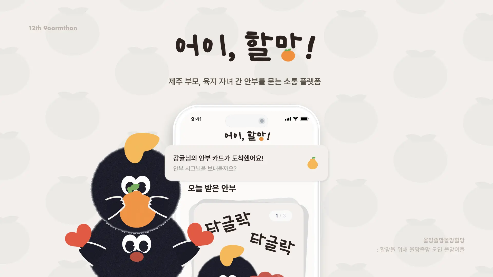
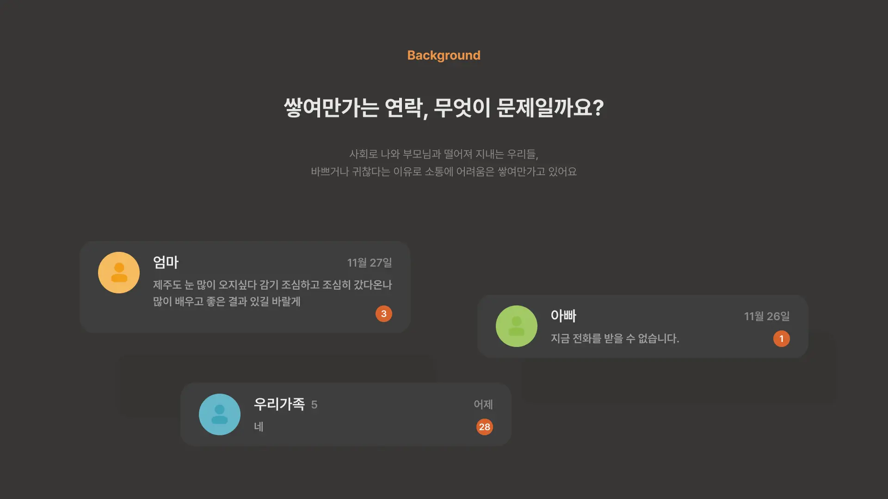
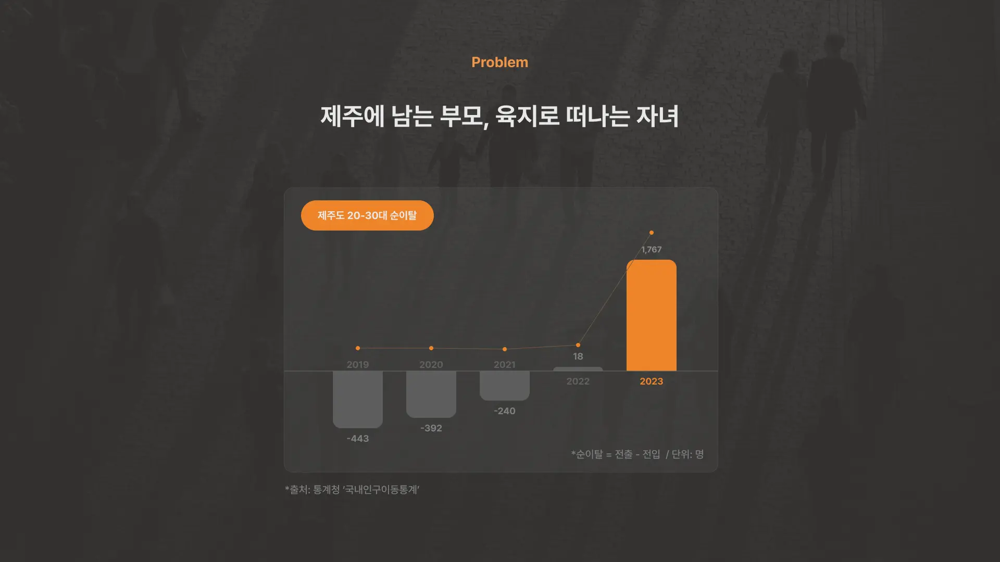
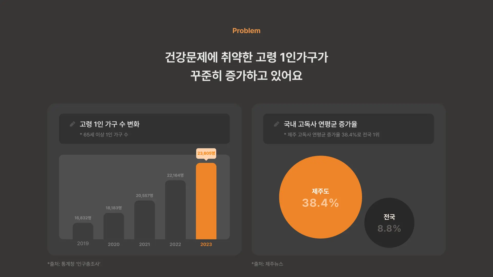
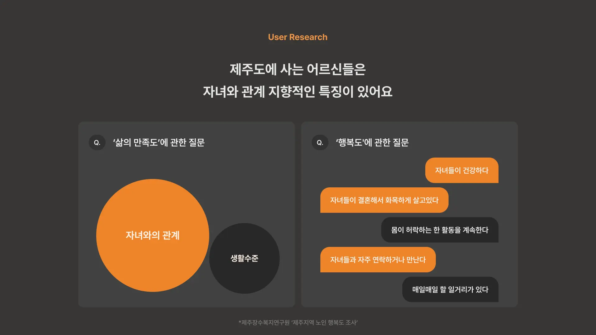
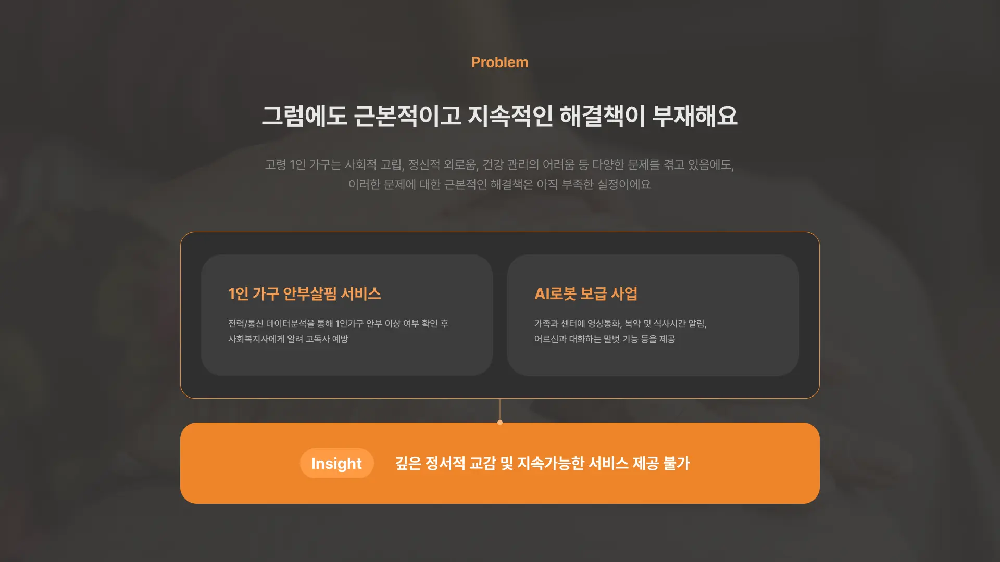
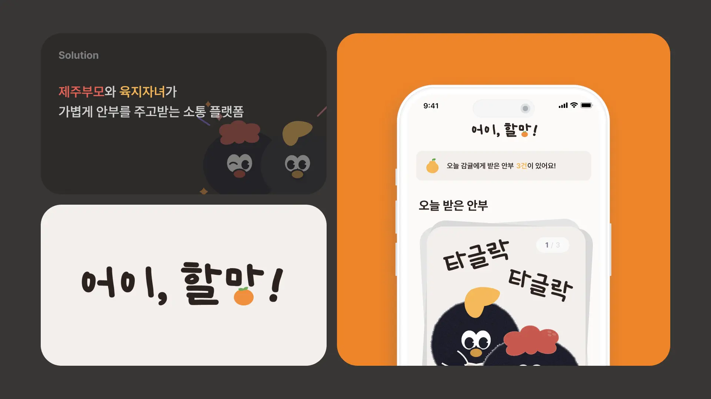
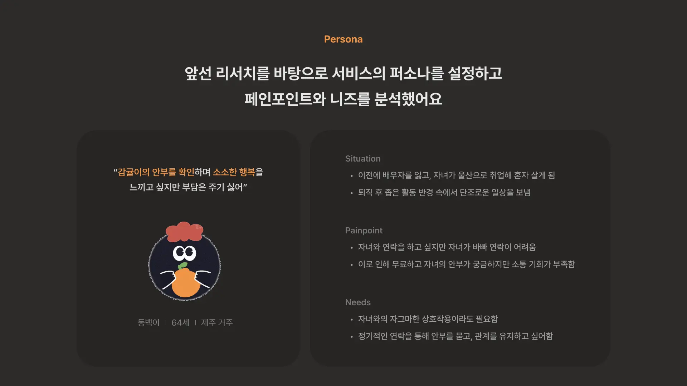
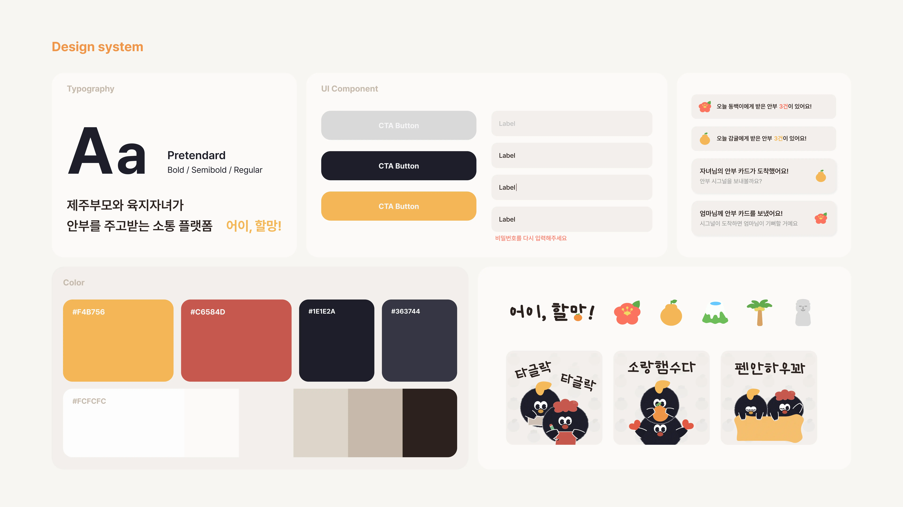
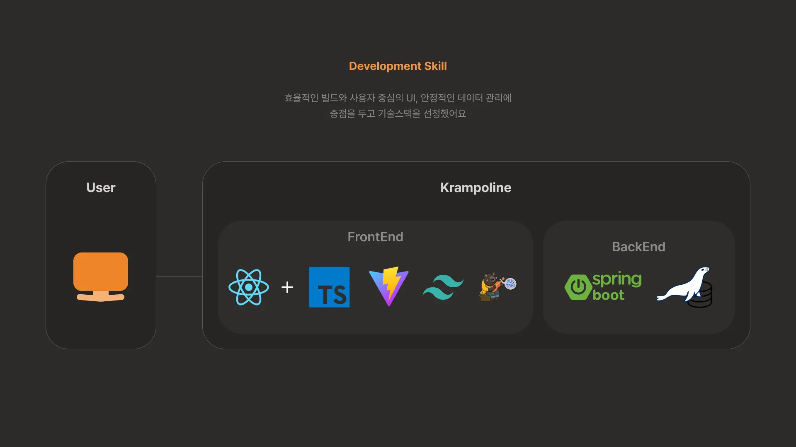

# 어이, 할망!

☁️ **12기 구름톤 KEYWORD**

**#제주 #클라우드 #고령화**

---

## 🪐 배경 Background

**어이, 할망! 이란?**

> ’어이, 할망!’은 `제주`와 `육지`에 거주하는 `부모`와 `자녀`가 가볍게 안부를 주고받을 수 있도록 돕는 플랫폼입니다. 이 서비스는 제주 방언인 ‘어이, 할망’을 이름으로 사용하여, 마치 다정하게 할머니에게 말을 거는 듯한 친근한 느낌을 전달합니다.

---

## 🪐 문제 정의 Problem

1️⃣ **고령화 및 세대 분리로 인한 소통 단절**

- 제주에서는 자녀 세대의 육지 이주가 증가하며 부모와 자녀 간 물리적·심리적 거리가 점차 멀어지고 있습니다.
- 이로 인해 고령 1인 가구는 정기적인 소통 부족으로 정서적 고립감을 느끼며, 이는 고독사와 같은 건강 문제로 이어질 가능성이 큽니다.

2️⃣ **기존 안부살핌 서비스의 한계**

- 현재 시행 중인 1인 가구 안부살핌 서비스와 AI 로봇 보급 사업은 단순한 알림 위주로 이루어져 정서적 교감이 부족하며, 장기적인 지속 가능성에도 한계를 보이고 있습니다.
- 이는 부모와 자녀 간의 관계를 심화시키기보다는 일시적인 정보 제공에 그치는 결과를 초래합니다.

3️⃣ **심리적 허들로 인한 상호작용 부재**

- 노년층 사용자들은 디지털 기기에 대한 익숙함 부족으로 소통 플랫폼을 활용하는 데 어려움을 겪고 있습니다.
- 특히 기존 소통 도구들은 복잡한 인터페이스와 낮은 접근성으로 인해 심리적 부담을 초래하며, 정기적인 소통을 어렵게 만듭니다.

---

## 🪐 방향성 Directionality

1️⃣ **정서적 유대감을 기반으로 한 지속 가능한 소통 플랫폼**

- 기존 복잡한 소통 플랫폼과 달리, 부모와 자녀가 간편하게 사용할 수 있도록 설계된 플랫폼입니다.
- 단순 안부 확인 기능을 통해 정기적이고 자연스러운 상호작용을 유도하며, 부모와 자녀 간의 정서적 유대감을 강화합니다.

2️⃣ **간소화된 접근성과 제주 특화 서비스 제공**

- 노년층 사용자도 쉽게 사용할 수 있도록 간소화된 인터페이스와 상호작용을 제공합니다.
- 제주의 전통과 상징성을 반영한 서비스로, 사용자들에게 감각적 즐거움과 친근함을 느낄 수 있게 합니다.

3️⃣ **고령화 문제 해결을 위한 관계 중심적 솔루션 제시**

- 단순히 기술 기반의 정보 제공을 넘어, 가족 관계를 중심으로 한 고령화 문제 해결책을 제시합니다.
- 부모와 자녀 간의 정서적 교감이 가족과 지역 사회의 안정성 강화로 이어지도록 돕습니다.

---

## 🪐 서비스 특징 Point

🍊 **Point 1. 심리적 허들을 낮춘 간소화된 상호작용**

- 다양한 수단을 제공하는 기존 커뮤니케이션 플랫폼과 달리, 안부 확인이라는 **특화된 목적**에 맞춘 설계를 적용하였습니다.
- 부모와 자녀 간 정기적인 상호작용을 유도하며, 간단하고 직관적인 인터페이스로 **심리적 부담을 최소화**합니다.

🍊 **Point 2. 제주스러운 테마로 지역 정체성 강화**

- UI와 콘텐츠에 **제주의 방언**과 **상징적 요소**를 활용하여, 서비스 전반에서 제주 특유의 정서를 느낄 수 있도록 설계되었습니다.
- 서비스명 ‘어이, 할망’을 통해 사용자가 정감 있고 친근한 소통을 경험할 수 있습니다.

🍊 **Point 3. 고령자 친화적인 인터페이스**

- **간소화된 메뉴**와 **큰 아이콘**을 사용하여 고령자도 손쉽게 조작할 수 있는 직관적인 환경을 제공합니다.
- 단순한 동작만으로 조작이 가능해, 디지털 기기에 익숙하지 않은 사용자도 편리하게 사용할 수 있습니다.

---

## 🪐 사용자 Persona

---

## 🪐 디자인 Design

**🎨 Design System & Components**

---

## 🪐 해결방안 **Solution**

**💬 “부모와 자녀를 잇는 정서적 유대 플랫폼”**

> 부모와 자녀 간의 정기적인 소통을 통해 정서적 유대감을 강화합니다. 단순한 안부 확인을 넘어서, 지속적이고 자연스러운 상호작용을 유도하여 가족 간의 연결성을 확대하고 고령자의 정서적 안정과 건강 문제 예방에 기여합니다.

---

## 🪐 핵심기능 Function

---

## 🪐 서비스 소개

🎥 **시연영상**

https://github.com/user-attachments/assets/e10aec9a-3ad6-49bb-90e5-81a15bf4b16c

📎 **배포**

[제주 부모, 육지 자녀 간 안부를 묻는 소통 플랫폼. '어이, 할망'](https://kdf1e08e83c6ba.user-app.krampoline.com)

---

## 🪐 개발 Development

### 🛠 시스템 아키텍쳐 System Architecture

### 프론트엔드 Frontend

> ⚙️ React, TypeScript, Tailwind CSS, Vite, Zustand, React Query

**React**

• 컴포넌트 기반 아키텍처로 UI 요소를 재사용 가능하고 유지 보수하기 쉽게 설계했습니다.

• 외부 API와의 비동기 통신을 통해 실시간 데이터 연동을 구현했습니다.

**TypeScript**

• 정적 타입 시스템을 도입하여 코드 안정성과 유지 보수성을 강화했습니다.

• 개발 중 발생할 수 있는 잠재적 오류를 사전에 방지하며, 생산성을 높였습니다.

**Tailwind CSS**

• 클래스 기반 스타일링으로 빠르고 유연한 UI 구현을 가능하게 했습니다.

• 커스터마이징 기능을 활용해 색상 팔레트와 테마를 프로젝트에 맞게 구성했습니다.

**Vite**

• 빠르고 효율적인 빌드 환경을 제공하여 개발 속도를 극대화했습니다.

**Zustand**

• 가볍고 직관적인 상태 관리 라이브러리를 사용하여 부모-자녀 간의 상태를 효과적으로 관리했습니다.

• 상태 변경에 따른 렌더링 최적화를 통해 성능을 향상시켰습니다.

**React Query**

• 서버 상태 관리를 효율적으로 수행하며, 캐싱 및 비동기 데이터 페칭을 최적화했습니다.

• 데이터의 최신성을 유지하면서도 네트워크 요청을 줄여 사용자 경험을 개선했습니다.

---

### 백엔드 Backend

> ⚙️ Spring Boot, Spring Data JPA, QueryDSL, Spring Security, JWT, MariaDB, Nginx, Krampoline

**Spring Boot**

• 빠른 초기 설정과 간편한 배포 프로세스를 통해 빠른 프로젝트 진행과 즉각적인 스펙 변화에 대응할 수 있게 했습니다.

**Spring Data JPA**

• DataBase에 요구되는 스펙을 애플리케이션 레벨로 추상화하여 비즈니스 로직을 구현하는데 집중할 수 있도록 했습니다.

**QueryDSL**

• 복잡한 쿼리의 가독성을 높이고 스펙 추가 및 변화와 디버깅에 빠르게 대응할 수 있게 했습니다.

**Spring Security/JWT**

• 웹 서비스 인증/인가 과정에 필요한 복잡한 필터 구조를 추상화하고 서비스 이용에 필요한 유저 인식 스펙에 관련된 비즈니스 로직을 원활히 처리할 수 있도록 했습니다.

**MariaDB**

• 영속성이 필요한 데이터를 저장하기 위한 데이터베이스로 MariaDB를 사용했습니다.

**Nginx**

• 웹 서비스 도메인으로 들어온 요청의 로드밸런싱 및 라우팅을 위한 리버스 프록시로 Nginx를 사용하였습니다

**Krampoline**

• Container 가상화 및 k8s 기반 오케스트레이션를 통한 배포 파이프라인을 원활히 수행하기 위해 Krampoline 플랫폼을 사용하였습니다.

---
